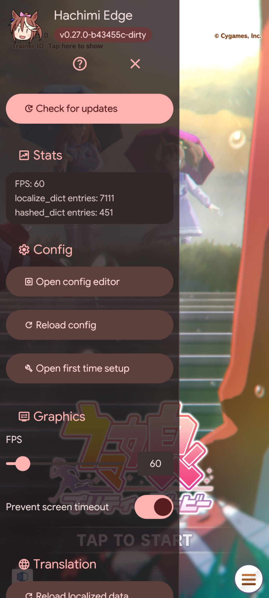

  
  <h1>Hachimi Edge</h1>
  
<b>Mod cải thiện và dịch thuật game cho UM:PD</b>

  
<a href="../README.md">English</a> | <a href="README-es.md">Español</a> | <a href="README-fil.md">Filipino</a> | <a href="README-id.md">Bahasa Indonesia</a> | <a href="README-ja.md">日本語</a> | <a href="README-ko.md">한국어</a> | <a href="README-pt-br.md">Português (Brasil)</a> | <a href="README-ru.md">Русский</a> | Tiếng Việt | <a href="README-zh_cn.md">简体中文</a> | <a href="README-zh_tw.md">繁體中文</a>

  

     
  

  

    
    
  

  

## ⚠️ Hướng dẫn chia sẻ và phân phát lại

Dự án này sửa đổi hành vi runtime của trò chơi và vi phạm Điều khoản Dịch vụ (TOS) của ứng dụng đích. Nhà phát triển trò chơi gần như chắc chắn sẽ muốn loại bỏ nó nếu biết đến. Để giảm thiểu rủi ro cho dự án và cộng đồng người dùng, vui lòng tuân theo các hướng dẫn sau:

- **Đừng đăng liên kết trực tiếp** đến kho lưu trữ này, trang web của dự án hoặc các công cụ liên quan trên các trang web, diễn đàn hoặc mạng xã hội công khai.
- Chỉ chia sẻ thông tin qua tin nhắn riêng hoặc các nhóm cộng đồng tự quản lý.
- Khi nhắc đến ứng dụng đích nơi công cộng, hãy dùng cách gọi gián tiếp (chẳng hạn "UM:PD" hoặc "Trò chơi ngựa" ấy) để tránh bị công cụ tìm kiếm đánh chỉ mục.

**Hoặc cứ chia sẻ và phá hỏng mọi thứ cho hàng chục người dùng Hachimi. Tùy bạn.**

> [!WARNING]
> **Nếu bạn vẫn muốn chia sẻ**
> Cứ làm điều bạn phải làm, nhưng chúng tôi thành kính đề nghị bạn cố gắng gọi trò chơi là "UM:PD" hoặc "Trò chơi ngựa" thay vì tên thật, để tránh bị công cụ tìm kiếm phân tích.

## Tính năng

- **Bản địa hóa chất lượng cao:** Hỗ trợ định dạng văn bản nâng cao (dạng số nhiều, số thứ tự, tự co giãn bố cục động) mà không cần sửa asset thủ công. Cũng dịch được phần lớn thành phần trong game; không cần vá asset thủ công!
  - Các thành phần được hỗ trợ:
    - Văn bản giao diện (UI)
    - Mục trong cơ sở dữ liệu (`master.mdb`, tên và mô tả kỹ năng)
    - Cốt truyện đua và hội thoại kịch bản chính
    - Lời bài hát
    - Thay thế texture và sprite atlas động
  - Hệ thống ngôn ngữ có thể cấu hình, hỗ trợ từ điển bản địa hóa tùy chỉnh.
- **Dịch máy tự động (tùy chọn):** Bản dịch từ cộng đồng và dịch máy cho các văn bản chưa được gói bản địa hóa bao phủ, áp dụng trực tiếp trong game.
- **Cấu hình ngay trong game:** Trình chỉnh sửa cấu hình GUI tích hợp cho phép tinh chỉnh cài đặt theo thời gian thực mà không cần khởi động lại ứng dụng.
- **Tự động cập nhật bản địa hóa:** Trình cập nhật tích hợp tải về và nạp lại các gói dịch thuật mới ngay khi trò chơi đang chạy.
- **Cải thiện đồ họa:** Các tính năng tối ưu thiết bị, bao gồm mở khóa giới hạn tốc độ khung hình (FPS unlock) và co giãn độ phân giải.
- **Đa nền tảng:** Hỗ trợ gốc trên Windows (DLL proxy DirectX 11) và Android (hook nội tuyến Zygisk / Dobby).
- **Tích hợp desktop Windows:** Discord Rich Presence, điều khiển đa phương tiện Windows Media Transport (SMTC) với hình thu nhỏ bìa bài hát trực tiếp, và báo cáo tiến trình trên thanh tác vụ.

## Cài đặt

Xem [tài liệu Bắt đầu](https://hachimi.noccu.art/docs/hachimi/getting-started.html) chính thức.

## Biên dịch từ mã nguồn

Hướng dẫn chi tiết về biên dịch và thiết lập môi trường nằm trong [BUILDING-vi.md](BUILDING-vi.md).

## Tuyên bố về việc sử dụng AI / LLM

Một số phần của Hachimi Edge — bao gồm mã nguồn, tài liệu và nội dung bản dịch — đã được viết hoặc chỉnh sửa với sự hỗ trợ của các mô hình ngôn ngữ lớn (LLM) và công cụ AI khác. Mọi nội dung do AI hỗ trợ đều được rà soát trước khi đưa vào, nhưng vẫn có thể chứa sai sót, dịch sai hoặc hành vi ngoài ý muốn. Hãy tự cân nhắc khi sử dụng; chúng tôi không bảo đảm tính chính xác của nội dung do AI tạo ra.

## Ghi công & Tham khảo

Hachimi Edge kết hợp các khái niệm và kỹ thuật do các dự án mã nguồn mở sau đây thiết lập:

- [Trainers' Legend G](https://github.com/MinamiChiwa/Trainers-Legend-G)
- [umamusume-localify-android](https://github.com/Kimjio/umamusume-localify-android)
- [umamusume-localify](https://github.com/GEEKiDoS/umamusume-localify)
- [Carotenify](https://github.com/KevinVG207/Uma-Carotenify)
- [umamusu-translate](https://github.com/noccu/umamusu-translate)
- [frida-il2cpp-bridge](https://github.com/vfsfitvnm/frida-il2cpp-bridge)

## Giấy phép

Dự án này được cấp phép theo [GNU General Public License v3.0](../LICENSE).
